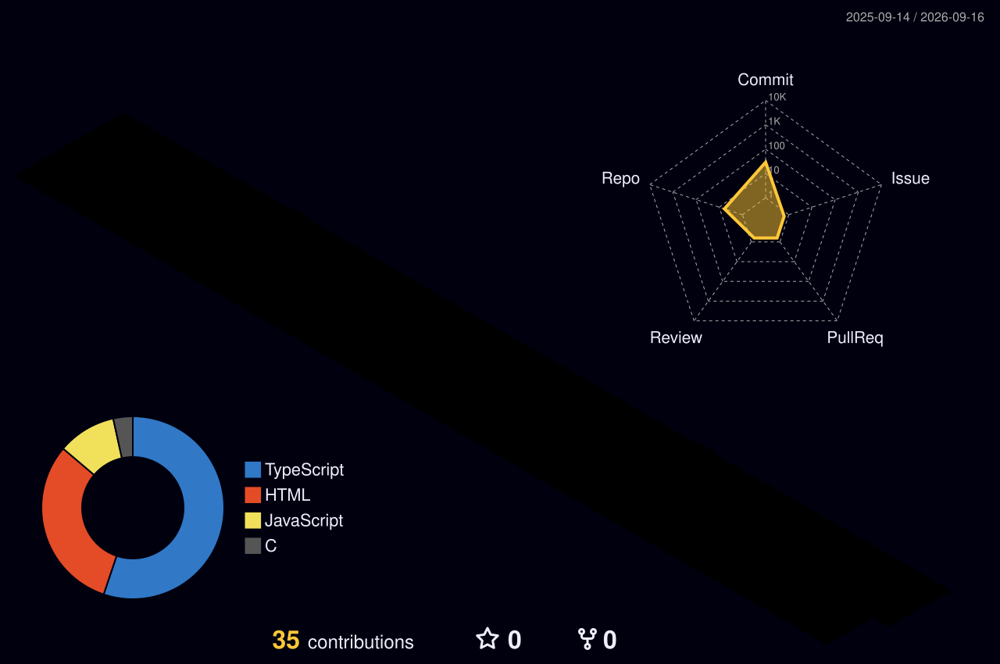

# Oh hi!

The name is Afif, and welcome to my github profile! I'm a web development enthusiast that decided to take on web development as a career for life.

Feel free to look around.

---

---

### I speak with these languages

    
More web development skills

### Made cool looking websites using these badass css frameworks

### Frequently uses the following database tooling

### I may be undergrad but I have a degree with these javascript runtimes

### Heard about one man development team? I can also be the DevOps department

### Other software and tooling I am familiar with

---

## Contributions Stats

